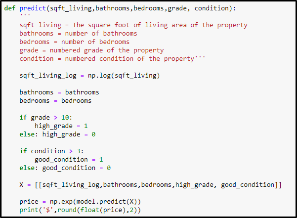

# King County Sales Analysis & Model

**Author**: [Blake Elieff](mailto:blakeelieff@hotmail.com)

## Project Overview

This project takes in the dataset provided for King County sales and produces a model that can determine the sale price of a house given different values for different features

### Business Problem

Century 21 requires a function that can determine the sale price of a home given a set of features. A few questions that are to be answered are :
* What does adding a bathroom do to the price?
* What does adding a sqft to to the price?
* What effect does a change in grade have on price?

### The Data

1 dataset it used. This data set is the kc_house_data.csv
I also used column_names.md to determine what each column name actually meant

#### Column Names and descriptions for Kings County Data Set
* **id** - unique identified for a house
* **dateDate** - house was sold
* **pricePrice** -  is prediction target
* **bedroomsNumber** -  of Bedrooms/House
* **bathroomsNumber** -  of bathrooms/bedrooms
* **sqft_livingsquare** -  footage of the home
* **sqft_lotsquare** -  footage of the lot
* **floorsTotal** -  floors (levels) in house
* **waterfront** - House which has a view to a waterfront
* **view** - Has been viewed
* **condition** - How good the condition is ( Overall )
* **grade** - overall grade given to the housing unit, based on King County grading system
* **sqft_above** - square footage of house apart from basement
* **sqft_basement** - square footage of the basement
* **yr_built** - Built Year
* **yr_renovated** - Year when house was renovated
* **zipcode** - zip
* **lat** - Latitude coordinate
* **long** - Longitude coordinate
* **sqft_living15** - The square footage of interior housing living space for the nearest 15 neighbors
* **sqft_lot15** - The square footage of the land lots of the nearest 15 neighbors

### Methods

In this project i used logarithmic scaling, Train Test Splits, and One Hot Encoding.
I used a variety of functions based on functions imported from the sklearn library

### Results
Here is the function that i produced to determine pricing using my final data model



From the model that i created i was able to answer the questions that were asked in the beginning


Adding a bathroom could potentially add $35112 to the house sale price


Per sqft adds approximately $195 to the sale price


A change in grade of the house could potentially increase the price by $276017

### Conclusions

From this analysis and model production. I can conclude that century 21 should use the size of the house, the grade, condition, number of bedrooms and number of bathrooms to determine a potential sale price. Grade is a strong determing factor in sale price, being an increase in approximately $276017 for the median sale in this dataset. 

This model isnt very accurate at determining an actual price. Its better used for calculating increase in value based on different changes in values of features for a house. My Model determines a mean average error of +- $164,000 hence why this shouldnt be used to determine the actual prices of the houses.

As i removed quite a few features from this analysis, i was not able to determine a lower mean average error. This may have been reduced by splitting up the sales into their date ranges aswell as location data. As usually closer to cities will produce a higher price per sqft. Going forward i would use these values in a future analysis.


### For more information

See the full analysis in the [Jupyter Notebook](./king_county_housing_analysis) or review this [presentation](./king_county_housing_presentation.pdf).

### Repository Structure

```
├── images
├── data
├── functions
├── README.md
├── king_county_housing_analysis.ipynb
└── king_count_housing_presentation.pdf
```

